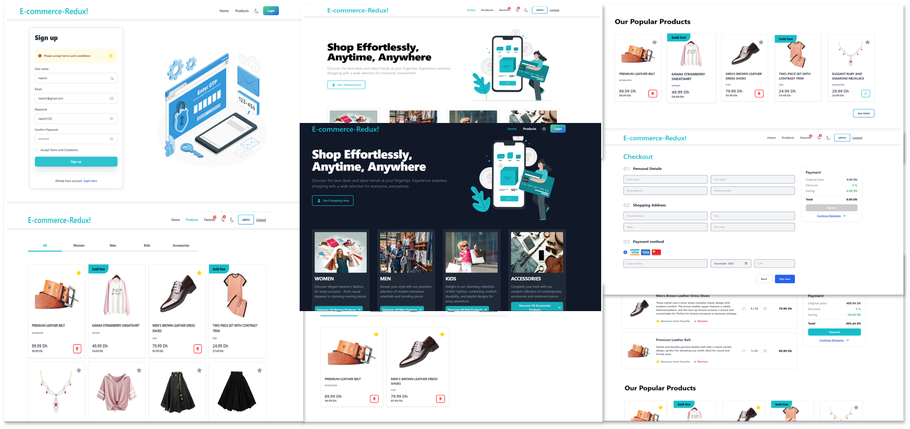

# E-commerce -- Projet de fin de Module M204

## Navigation

- [Preview](#preview)
- [Description](#description)

## Preview

Discover the live demo [here](https://ecommerce.nassim.online/)

## Description

E-commerce website built using React, Redux, and other modern web technologies. The website allows users to browse products, add them to their cart, and make purchases. It also includes features like user authentication, product filtering, and sorting. The project is designed to be responsive and user-friendly. The website is hosted on Netlify and can be accessed [here](https://ecommerce.nassim.online/).

##
