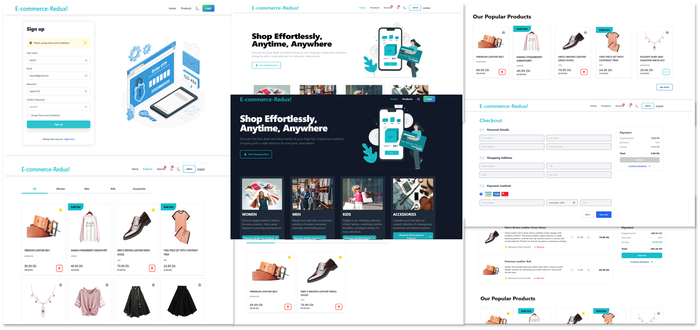

# E-commerce -- Projet de fin de Module M204

## Navigation

- [Preview](#preview)
- [Description du projet](#description-du-projet)
- [Technologie Utilisé](#technologie-utilisé)
- [Installation et Utilisation](#installation-et-utilisation)
  - [Installation](#installation)
  - [Utilisation](#utilisation)

## Preview

Discover the live demo [here](https://ecommerce.nassim.online/)



## Description du projet

E-commerce website built using React, Redux, and other modern web technologies. The website allows users to browse products, add them to their cart, and make purchases. It also includes features like user authentication, product filtering, and sorting. The project is designed to be responsive and user-friendly. The website is hosted on Netlify and can be accessed [here](https://ecommerce.nassim.online/).

## Technologie Utilisé

- **Frontend**: React JS

  - **Styling**: Tailwind CSS

  - **Routing**: React Router Dom

  - **API && Requests**: Axios

  - **State Management**: Redux Toolkit

- **backend/authentification** : Node JS, Epress

- **Deploiement** : Netify

## Installation et Utilisation

### Installation

1. Clone the repository:

   ```bash
   git clone https://github.com/mziliNassim/ecommerce.git
   ```

2. Navigate to the project directory:

   ```bash
   cd ecommerce
   ```

3. Install the Frontend dependencies:

   ```bash
   cd client
   npm install
   ```

4. Install the backend dependencies:

   ```bash
   cd server
   npm install
   ```

### Utilisation

1. Start the development

   ```bash
   # Start the development client side:
   npm run dev

   # Start the development server side:
   npm run start
   ```

2. Open your browser and navigate to `http://localhost:5173/` to view the website.

##
